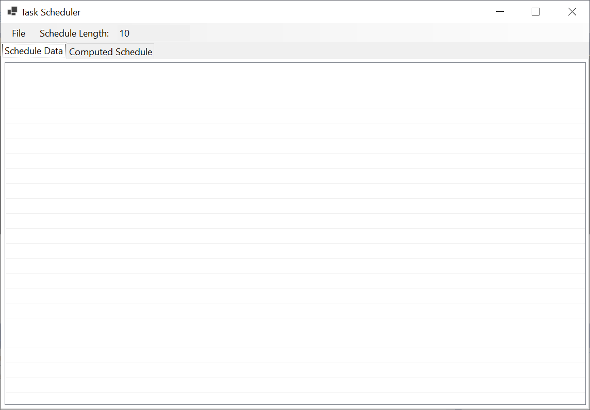
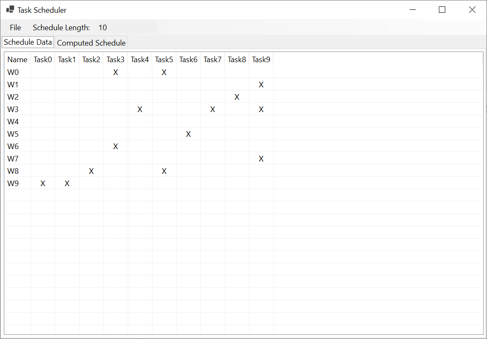
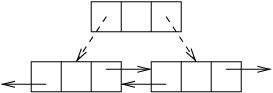
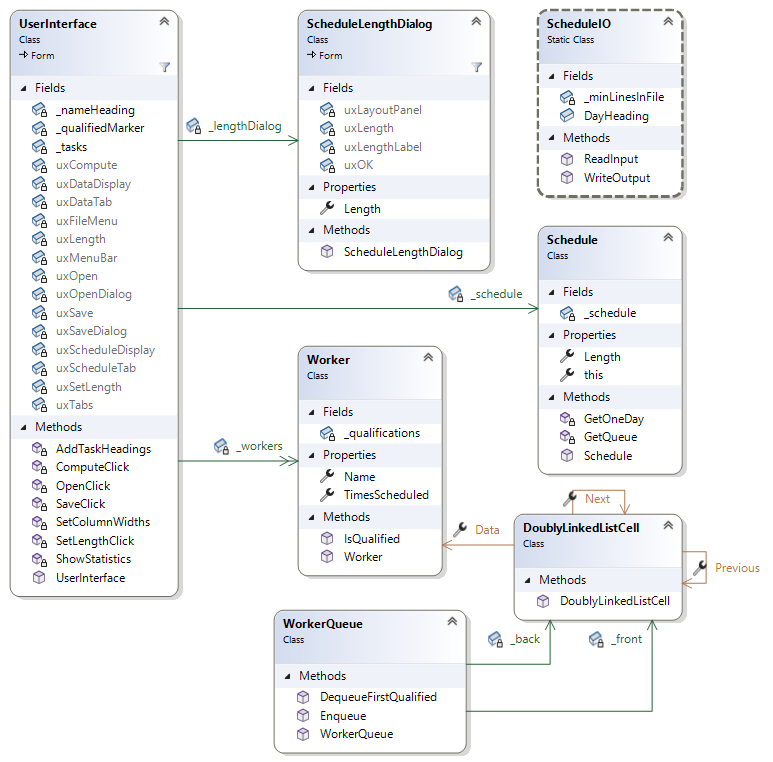

# Homework Assignment 2: Scheduling Workers

For this assignment, you will write a complete program to produce day-by-day schedules of workers for various tasks.

## 0. Contents

[TOC]

<hr/>

## 1. User Requirements

A large organization has a number of local offices. Each office has a certain number of workers, each of whom is qualified to be responsible for certain tasks. You are to write a program that individual offices can use to construct daily schedules for a given number of days, so that for every day of the schedule, each task is covered by some worker. Ideally, each worker should be scheduled for no more than one task on any day, and should be scheduled about the same number of times as every other worker. Our approach will attempt to meet these goals, but will not guarantee them.

The qualifications of the workers are given in files of a certain format. Your program should also be capable of writing the schedules that it produces to files in a certain format. These file formats are described in what follows. The program should also be capable of displaying to the user both the data from the input files and the schedules it produces in an easy-to-read format. The details of this format are discussed in [Section 3. User Interface](#3-user-interface).

### 1.1. Input File Format

The input file should be a plain text file in which each line contains a number of fields separated by commas. Some of these fields may be empty. The file should contain at least two lines, and each line should contain the same number of fields. Note that if files in this format are viewed in typical spreadsheet applications, the fields are organized into columns.

The first line of the file should contain column headings, separated by commas. The first heading is for a column containing worker names - this heading may be anything (or empty), as it will be unused by the program. The subsequent headings are the names of the different tasks. Thus, if there are *n* tasks, the first line will contain *n*+1 fields. We will refer to these tasks as tasks 0, 1, ..., *n*-1; i.e., the second field corresponds to task 0, etc.

The following lines of the file contain the workers' names and qualifications. The first field of each line will contain the name of a worker. Each subsequent field will indicate whether the worker is qualified for the task corresponding to that column. A nonempty field indicates that the worker is qualified for that task, and an empty field indicates that they are not qualified for that task. Thus, for example, the line:

```
Pat,,x,x,,,x,
```

indicates that Pat is qualified for tasks 1, 2, and 5, but not for tasks 0, 3, 4, and 6.

Sample input files are provided in the **Data** folder of your repository for this assignment (see [Section 2. Starting the Assignment](#2-starting-the-assignment)).


###  1.2. Output File Format

This file also consists of a number of lines of plain text, and each line contains fields separated by commas. The first line contains column headings. Its first field contains the string, "Day", and successive fields contain the names of the tasks provided in the input file. Thus, the first line of the output file should be identical to the first line of the input file, except for the first field.

Each of the remaining lines contains the schedule for one day. The first field contains the day number, starting with 1 (in the second line) and continuing for the number of days required. Subsequent fields in each line each contain the name of the worker that is assigned the corresponding task on that day. If some task has no worker assigned for that day, that field is empty. 

For example, if the first line is:

```
Day,Lead,Backup,Guitar,Bassoon,Drums
```

and the third line is:

```
2,John,Paul,George,,Ringo
```

then this indicates that on day 2, John was assigned the task "Lead", Paul was assigned the task "Backup", George was assigned the task "Guitar", no one was assigned the task "Bassoon", and Ringo was assigned task "Drums". 

Sample output files are provided in the **Data/computedExamples** folder of your repository for this assignment (see [Section 2. Starting the Assignment](#2-starting-the-assignment)).

## 2. Starting the Assignment

Create a GitHub repository using the link provided in the Canvas assignment and clone it to your local machine. This repository should contain the following:

- A Visual Studio solution containing a new Windows Forms Application with an additional unit test project, **Ksu.Cis300.Scheduler.Tests**. 
- The folder **Data**, which contains some specific test data files and a subfolder, **computedExamples**, containing some sample output files.

Note that no code is provided other than the unit test code. You will need to write the entire program, including designing the GUI.

## 3. User Interface

In this section, we will describe the look and behavior of the GUI that you are to design. We will first outline what you will need to build using the Design window. Then we will describe the required behavior of the GUI. You will need to provide code to implement this behavior (see [Section 6. Coding Requirements](#6-coding-requirements)). The [demo video]() also illustrates the expected look and behavior.

### 3.1. Manual User Interface Design

Using the Design window, you will need to design a GUI resembling the following:



At the top is a **MenuStrip**. Both "File" and "Schedule Length:" are **MenuItem**s, but the "10" is in a **TextBox** (use the drop-down menu marked "Type Here" to select **MenuItem** or **TextBox**, as appropriate, before typing in the text). The "File" menu should contain the following menu items:

- Open Data File
- Compute Schedule
- Save Schedule

The first of these menu items should be enabled initially, but the other two should be disabled. Make the **TextBox** in the **MenuStrip** read-only using its **ReadOnly** property.

Below the **MenuStrip** is a **TabControl**. In order to cause the **TabControl** to fill the entire remaining area, click the drop-down to the right of its **Dock** property, then click the large button in the center of the drop-down menu. To set the contents of the tabs, click the **TabPages** property, then click the "..." button to its right. This will open a window with the two tabs listed in the list on its left side. For each of these tabs, click the tab name in the left panel and change the following properties in the panel on the right:

- **Text**: The text to be displayed in the tab (see the figure above).
- **(Name)**: This should be changed to meet the [naming convention](https://cis300.cs.ksu.edu/appendix/style/naming/index.html) for a graphical control.

After both tabs are changed in this way, click the "OK" button.

To set the contents of each tab page, first click the tab to select that page, then add a **ListView** to the page. Set its **Dock** property to fill the tab page, and set its **View** property to **Details** - this will cause it to display its contents arranged in a grid. Finally, set its **GridLines** property to **True** so that lines will be drawn between rows and columns of the grid.

**Note:** At times, you may find it difficult to select a particular control on the form. If this is the case, you can use the `Tab` key to step through the controls one at a time.

Besides the visible controls, you will also need to add an **OpenFileDialog** for selecting an input file and a **SaveFileDialog** for selecting an output file. For each of these dialogs, set the **FileName** property to the empty string, and set the **Filter** property to the following:

```
CSV spreadsheet files|*.csv|All files|*.*
```

This filter will cause `.csv` files to be shown by default.

Finally, you will need to define another form that will be used to change the value in the **TextBox** within the **MenuStrip**. Right-click on the **Ksu.Cis300.Scheduler** project (in bold face), and select "Add->Form (Windows Forms)...".  Enter the name "ScheduleLengthDialog.cs", and click the "Add" button. In the resulting Design window, define a form resembling the following:


First, add a **FlowLayoutPanel** to hold the visible controls, and set this panel's **FlowDirection** property to **TopDown**. This will cause the controls that you will add to this panel to be laid out automatically from top to bottom. As a result, the layout will be more consistent on different displays. Add the following to this panel:

- A **Label** containing the text, "Schedule Length:".
- A **NumericUpDown**. Set its **TextAlign** property to **Right**, its **Minimum** property to 1, and its **Maximum** property to 1000. The value within this **NumericUpDown** will be set by code (see [Section 6. Coding Requirements](#6-coding-requirements)).
- A **Button** containing the text, "OK". To cause this button to close the form, returning **DialogResult.OK** from the method that displayed it, set its **DialogResult** property to **OK**.

After these controls have been added, set the **FlowLayoutPanel**'s **AutoSize** property to **True** and its **AutoSizeMode** property to **GrowAndShrink**. This will resize the panel to be just large enough to hold its controls. Then set the form's **AutoSize** and **AutoSizeMode** properties in the same way. The form's size shown in the Design window won't change, but when it is displayed by the program, it will be resized so that its controls just fit within it.

Two more of the form's properties need to be changed to make it behave correctly. First, to cause the `Enter` key to close the form as if the "OK" button had been clicked, set the **AcceptButton** to the name of the "OK" button. Second, to disable the maximize box, set the **MaximizeBox** button to **False**. In conjunction with the setting of the **AutoSize** property, this will prevent the form from being resized.

### 3.2. Behavior of the GUI

Here we describe the behavior that will need to be implemented in code (see [Section 6. Coding Requirements](#6-coding-requirements)).

Clicking the "Schedule Length:" menu item in the main form should cause the **ScheduleLengthDialog** to be displayed as a modal dialog. The value in the **NumericUpDown** should be the same as the current value within the **TextBox** in the main form. The user may then set this value to any positive integer value no greater than 1000. If the user either presses the `Enter` key or clicks the "OK" button, the dialog should close, and the value in the **TextBox** should be set to the value from the dialog's **NumericUpDown**. If the user closes the dialog by clicking the 'X' in the upper-right corner, nothing in the main form should change.

Clicking the "Open Data File" menu item should cause the **OpenFileDialog** to be displayed. It should not display a file name the first time it is shown, but subsequently, it should show the name of the last input file selected. The drop-down above the "Open" and "Cancel" buttons should read, "CSV spreadsheet files (\*.csv)", by default, though clicking it should allow "All files (\*.\*)" to be selected.

If the user selects a file, the program should attempt to read that file to obtain a list of workers and the tasks they are qualified to perform (see [Section 1.1. Input File Format](#11-input-file-format) above). If the file is read successfully, the "Compute Schedule" menu item should be enabled, the "Save Schedule" menu item should be disabled, and the data loaded from the CSV file should be displayed in the **ListView** contained inside the "Schedule Data" tab page, which should be displayed, and any data contained within the other **ListView** should be removed. For example, opening the provided data file, "10-10.csv" should cause the GUI to look as follows:



If reading the file causes an exception not due to programmer error to be thrown, it should display that error message in a **MessageBox** and leave the GUI unchanged. You will need to check explicitly for the following error conditions:

- The file contains fewer than two lines: throw an **IOException** containing the message "The file doesn't have enough lines."
- Some line after the first has a number of fields that is different from the first line: throw an **IOException** containing the message, "Line *n* contains the wrong number of fields." where *n* is the line number on which the error occurred (the first worker is described on line 2).

Clicking the "Compute Schedule" button (while it is enabled) should cause a schedule to be generated using the data most recently read from an input file. The number of days in the schedule should be the value from the **TextBox**. This schedule should be constructed using the algorithm described in [Section 4. Scheduling Algorithm and Data Structures](#4. Scheduling Algorithm and Data Structures). A **MessageBox** resembling the following should then be shown:


This message should indicate the minimum number of times any worker was scheduled, the maximum number of times any worker was scheduled, and the number of workers that were not scheduled at all. After this **MessageBox** is closed, the "Save Schedule" menu item should be enabled, and the generated schedule should be displayed in the **ListView** contained within the "Computed Schedule" tab page, which should be made visible. For example, the GUI should resemble the following after a schedule of length 10 is generated from "10-10.csv":


If the "Save Schedule" menu item is selected (when it is enabled), the **SaveFileDialog** should be displayed. It should not display a file name the first time it is shown, but subsequently, it should show the name of the last output file selected. The drop-down above the "Open" and "Cancel" buttons should read, "CSV spreadsheet files (\*.csv)", by default, though clicking it should allow "All files (\*.\*)" to be selected.

If the user selects a file, the schedule should be written to the selected file in the format described in [Section 1.2. Output File Format](#1.2. Output File Format). If the file is written successfully, the message "File successfully saved." should be shown in a **MessageBox**. If any exception is thrown during the writing of the file, it should be displayed in a **MessageBox**.

## 4. Scheduling Algorithm and Data Structures

In order to attempt to meet the scheduling goals, we will store the workers in a modified queue. The modification will allow us to dequeue the first (i.e., nearest to the front) worker qualified for a certain task. Thus, for each day, we will iterate through the tasks, scheduling a worker for each task on that day. We find the worker to schedule for that task by dequeuing the first worker qualified for that task. We then enqueue that worker to the back of the queue. Thus, the algorithm will always give preference to those workers who have been idle the longest. However, this algorithm will not always produce an optimal schedule.

We will implement this modified queue using a *doubly-linked list*. A doubly-linked list is similar to a linked list, but each cell in the list contains a reference to the *previous* cell in the list, in addition to the reference to the next cell in the list. Furthermore, we will use two *header cells* - one at the front and the other at the back. These header cells won't contain meaningful data, but will simply be used to keep track of the beginning and end of the list. The doubly-linked list therefore is structured as follows:


Note that in the header cell at the front, the reference to the previous cell is a reference back to the header cell itself, and that likewise, the reference to the next cell after the back header cell also references back to the header cell itself. We do this to avoid the need for **null** references. As a result, we can't iterate through a doubly-linked list by looping as long as the current cell is non-**null**. Instead, we need to loop as long as the current cell is not the appropriate header cell.

A doubly-linked list simplifies the process of finding a cell to delete - we no longer need to look ahead to the next cell. Instead, we can use the links in the cell we want to delete to access the two cells whose links need to be changed. The following image shows the updated references using dashed lines:


Note that because we are using header cells (which will never be deleted) at the front and back, there will always be cells preceding and following the cell we are deleting.

Inserting a cell is a little more involved for a doubly-linked list because more references need to be changed. First, we set the links in the cell we are inserting to the cells that are to precede and follow it:



Then we update the links in the preceding and following cells to refer to the cell being inserted:


The workers will also be stored in an array, and the names of the tasks will be stored in a **string[&nbsp;]**. However, where we don't need the names of the tasks, we will instead refer to the tasks using their locations within this **string[&nbsp;]**.

## 5. Software Architecture

Your program should contain seven classes, as shown in the following class diagram:



The **UserInterface** class defines the main GUI. The **ScheduleLengthDialog** class defines the dialog used to change the length of the schedule to be generated. The **ScheduleIO** class is a **static** class containing methods for reading and writing files. Instances of the **Worker** class represent individual workers. Instances of the **Schedule** class represent individual schedules. The **WorkerQueue** class defines the modified queue used to implement the scheduling algorithm, as outlined in [Section 4. Scheduling Algorithm and Data Structures](#4. Scheduling Algorithm and Data Structures). Instances of the **DoublyLinkedList** cell class are individual cells of a doubly-linked list. Each of these is described in more detail in [Section 6. Coding Requirements](#6. Coding Requirements) below.

Note that some of the fields and properties are shown in the above diagram as labels on arrows. This indicates that the class where the arrow begins contains a field or property with the arrow's label as its name, and the class where the arrow leads is the type of that field or property. For example, `_lengthDialog` is a **private** field of type **ScheduleLengthDialog** within the **UserInterface** class. Similarly, double-headed arrows indicate collections. For example, `_workers` is a collection (in this case, an array) of **Workers** within the **UserInterface** class.

The names of **private** fields and some **public** members in your program don't need to match the names shown above as long as they obey the [naming conventions for this course](http://people.cs.ksu.edu/~rhowell/DataStructures/redirect/naming). However, in order for the unit test code to compile, all **public** members of the **Schedule**, **Worker**, **WorkerQueue**, and **DoublyLinkedListCell** classes must match those shown.

## 6. Coding Requirements

Specific requirements for each of the classes are given in what follows. 

### 6.1. The Worker Class

In this class, you will maintain all of the information relevant to a single worker. You will need one **private** field, two **public** properties, a **public** constructor, and one **public** method.

#### 6.1.1. private field

You will need the following **private** field:

- A **bool**[ ] giving the qualifications of the worker. Specifically, element *i* will indicate whether this worker is qualified for task *i*, where the tasks are numbered starting with 0.

#### 6.1.2. Properties

You will need the following **public** properties:

- **Name**: Gets the worker's name as a **string**. Use the default implementation with no **set** accessor.
- **TimesScheduled**: Gets or sets an **int** property giving the number of times the worker has been scheduled. Use the default implementation.

#### 6.1.3. Constructor

You will need a **public** constructor that you will use to initialize the worker's name and qualifications. Recall that the name of a constructor is the same as the name of the class that contains it, and that a return type isn't supplied. It will take as its only parameter a **string[&nbsp;]** whose first element gives the worker's name, and whose subsequent elements indicate the worker's qualifications. Specifically, element *i*+1 will be a nonempty string if the worker is qualified for task *i*; otherwise it will be the empty string (note that the empty string is a **string** with length 0; i.e., it is "", not **null**). The length of the **bool[&nbsp;]** field will therefore need to be one less than the length of the **string[&nbsp;]** parameter.

If the given **string[&nbsp;]** is **null**, throw an **ArgumentNullException**. If it is non-**null** but has a length of 0, throw an **ArgumentException**.

#### 6.1.4. A public IsQualified method

This method will take as its only parameter an **int** identifying the task, and it will return a **bool** indicating whether this **Worker** is qualified for the given task. If the given **int** is outside the bounds of the **bool[&nbsp;]** field, throw an **ArgumentException**.

### 6.2. The DoublyLinkedListCell Class

Each instance of this class will implement a single cell of a doubly-linked list. This class is *not* generic; i.e., it has no type parameter. Instead, each cell will store a **Worker** as its data item.  You will need to define three **public** properties and a **public** constructor.

#### 6.2.1. Properties

You will need to define the following **public** properties:

- **Data**: Gets the **Worker** stored in this cell. Use the default implementation with no **set** accessor.
- **Next**: Gets or sets the next cell in the list (a **DoublyLinkedListCell**). Use the default implementation.
- **Previous**: Gets or sets the previous cell in the list (a **DoublyLinkedListCell**). Use the default implementation.

#### 6.2.2. Constructor

You will need a **public** constructor that takes as its only parameter the **Worker** to store in this cell. If the given **Worker** is **null**, throw an **ArgumentNullException**. Initialize the other two properties to this cell (i.e., to **this**).

### 6.3. The WorkerQueue Class

This class will be used to implement the modified queue as described in [Section 4. Scheduling Algorithm and Data Structures](#4. Scheduling Algorithm and Data Structures). The elements of this queue will be instances of the **Worker** class; hence, this will *not* be a generic class. This class will be implemented using a doubly-linked list as described in [Section 4. Scheduling Algorithm and Data Structures](#4. Scheduling Algorithm and Data Structures). You will need two **private** fields, a **public** constructor, and two other **public** methods.

#### 6.3.1. private fields

You will need **DoublyLinkedListCell** fields referring to the following cells in the list:

- the header cell at the front; and
- the header cell at the back.

You will need to initialize both of these to new instances, either where you define them or in the constructor (see the next section). For the **Worker** in each of these cells, construct a new instance with a single-element **string[&nbsp;]** containing the empty string as its element.

#### 6.3.2. Constructor

The **public** constructor should take no parameters. If you didn't initialize the two **private** fields where you defined them, you will need to do that here. Additionally, you will need to link these cells together to form a doubly-linked list.

#### 6.3.3. A public Enqueue method

This method should take as its only parameter the **Worker** to enqueue. It should return nothing. If the given **Worker** is null, throw an **ArgumentNullException**. Otherwise, insert the **Worker** in a new cell at the back of the list, just before the header cell at the back.

#### 6.3.4. A public DequeueFirstQualified method

This method should take as its only parameter an **int** indicating a task number. It should return a **Worker?** giving the first worker qualified for the given task, or **null** if no qualified worker is found. If it finds a qualified worker, the cell containing this worker should be removed from the list.

### 6.4. The Schedule Class

This class needs one **private** field, one **public** property, one **public** indexer, two **private** methods, and a **public** constructor.

#### 6.4.1. private field

The **private** field should be a **readonly string\[&nbsp;\]\[&nbsp;]** containing the schedule. This is an array of arrays; i.e., each element is a **string[&nbsp;]**. Each of these **string[&nbsp;]**s will contain a schedule for one day. The **string** at index *i* of the **string[&nbsp;]** at location *k* (i.e., element \[*k*\]\[*i*\] of the **string\[&nbsp;\]\[&nbsp;\]**) will be the name of the **Worker** assigned to task *i*. 

#### 6.4.2. public property

You will need a **public** property **Length** that gets an **int** giving the number of days in the schedule. Do *not* use the default implementation. Instead, return the length of the above field.

#### 6.4.3. public indexer

An [indexer](https://cis300.cs.ksu.edu/appendix/syntax/indexers/index.html) allows user code to index into a **Schedule** as if it were an array. The definition of an indexer is similar to a property definition, with the following differences:

- An indexer always has the name **this**.
- **this** is always followed by a nonempty parameter list enclosed in square brackets. In this case, the parameter list will consist of two **int** parameters giving a day within the schedule and a task number.

The type of the indexer should be **string**. It should have a **get** accessor that returns the element of the **string\[&nbsp;\]\[&nbsp;\]** field corresponding to the given day (where the first day is indicated by 0) and task. This will allow user code to get the name of the worker assigned to the given task on the given day by indexing into the schedule with the day and task number, as if the schedule were a 2-dimensional array. The indexer should not have a **set** accessor.

#### 6.4.4. A private method to get a WorkerQueue containing the Workers

This method should be **static**; hence, it won't be able to access the field, the property, or the indexer (you won't need any of these). It should take as its only parameter a **Worker[&nbsp;]** containing the workers to place into the queue. It should return a **WorkerQueue** containing these workers. As you place each worker into the queue, set its **TimesScheduled** property to 0.

#### 6.4.5. A private method to build a single day of the schedule

This method should also be **static**. It should take as its parameters a **WorkerQueue** containing the workers to schedule and an **int** giving the number of tasks. It should return a **string[&nbsp;]** whose length is the number of tasks. Element *i* of this array should give the name of the worker assigned to task *i*, where *i* is a nonnegative integer less than the number of tasks. Follow the algorithm provided in [Section 4. Scheduling Algorithm and Data Structures](#4. Scheduling Algorithm and Data Structures). If no qualified worker is found for some task, place the empty string into the corresponding location of the array to be returned. Whenever a qualified worker is added to the schedule, increment its **TimesScheduled** property.

#### 6.4.6. Constructor

The **public** constructor should take the following parameters:

- A **Worker[&nbsp;]** giving the workers.
- An **int** giving the number of tasks.
- An **int** giving the number of days in the schedule to be constructed.

If the given array is **null**, throw an **ArgumentNullException**. Otherwise, use the two **private** methods to get a **WorkerQueue** containing the given workers and to build the **string\[&nbsp;\]\[&nbsp;\]** field. To construct a new **string\[&nbsp;\]\[&nbsp;\]** of the appropriate size, use the number of days as the first index, and leave the second index empty; for example: `new string[n][]`. Then successive elements of this array can be assigned arrays returned by the above method.

### 6.5. The ScheduleIO Class

This class should be **static**. It will need two **static** fields and two **public static** methods.

#### 6.5.1. Fields

This class needs the following fields:

- A **public static readonly string** giving the string to use for the first column of the schedules displayed in the GUI and the output files. This string should be "Day".
- A **private static readonly int** giving the minimum number of lines that should be contained in an input file (2).

Use these fields, rather than the literals `"Day"` or `2` in the code that follows.

#### 6.5.2. A public static method to read a file

This method should take as its only parameter a **string** giving the name of the file to read. Its return type should be **(string[&nbsp;], Worker[&nbsp;])**. This type is a *value tuple*, which provides one mechanism for returning more than one object from a method. In this case, you will return a **string[&nbsp;]** giving the names of the tasks and a **Worker[&nbsp;]** giving the workers. Thus, if you have a **string[&nbsp;]** `t` and **Worker[&nbsp;]** `w`, you can return both using:

```c#
return (t, w);
```

If the given **string** is **null**, throw an **ArgumentNullException**. Otherwise, read the given file using [**File.ReadAllLines**](https://learn.microsoft.com/en-us/dotnet/api/system.io.file.readalllines?view=net-6.0), then check to see if the file has the minimum number of lines required - if not, throw the appropriate exception as stated in [Section 3.2. Behavior of the GUI](#3.2. Behavior of the GUI). Then use the first line's [**Split**](https://learn.microsoft.com/en-us/dotnet/api/system.string.split?view=net-6.0#system-string-split(system-char()) method to split it into fields delimited by commas (you can pass `','` as this method's only parameter). **Split** will return a **string[&nbsp;]** whose elements contain the separate fields. You won't need the first field; hence, you will need to copy the other fields to a new array containing one fewer location - this will be the array of task names that you will eventually return. For each subsequent line of the file, split it into an array of fields in the same way. Check to see that the number fields in each line is 1 more than the number of tasks; if not, throw the appropriate exception as outlined in [Section 3.2. Behavior of the GUI](#3.2. Behavior of the GUI). From each array of fields, you can construct a new **Worker**, and place it in a **Worker[&nbsp;]** to be returned later. Note that because the first line of the file does not contain the description of a worker, the indices in the **string[&nbsp;]** containing the lines of the file and the **Worker[&nbsp;]** accumulating the workers will differ by 1.

This method should do no exception handling.

#### 6.5.3. A public static method to write a schedule to a file

This method should take the following parameters:

- A **Schedule** giving the schedule to write.
- A **string[&nbsp;]** giving the names of the tasks.
- A **string** giving the name of the file to write.

It should return nothing. If any of the parameters are **null**, throw an **ArgumentNullException**. 

To do the I/O within this method, you will need to use a [**StreamWriter**](https://learn.microsoft.com/en-us/dotnet/api/system.io.streamwriter?view=net-6.0) and a **using** block as described in [Advanced Text File I/O](https://cis300.cs.ksu.edu/io/advanced-text-file/index.html). Write one field at a time using the **StreamWriter**'s [**Write**](https://learn.microsoft.com/en-us/dotnet/api/system.io.streamwriter.write?view=net-6.0#system-io-streamwriter-write(system-string)) method, including commas as described in [Section 1.2. Output File Format](#1.2. Output File Format). At the end of each line, call the **StreamWriter**'s [**WriteLine**](https://learn.microsoft.com/en-us/dotnet/api/system.io.textwriter.writeline?view=net-6.0#system-io-textwriter-writeline) method with an empty parameter list. Recall that you can obtain the name of the worker schedule for task *i* on day *k* by indexing into the schedule with *k* and *i* as if it were a 2-dimensional array. Keep in mind that days within the schedule are indexed beginning at 0, but will start at 1 in the output file.

### 6.6. The ScheduleLengthDialog Class

To allow user code to access the contents of the **NumericUpDown** defined within this class, you will need to add one **public** property to the code. This property needs to get or set a **decimal** giving the length of the schedule. The **get** accessor needs to return the value stored in the **NumericUpDown**.  The **set** accessor needs to assign the **value** keyword (which will contain the value assigned by the user code) to the value stored in the **NumericUpDown**.

### 6.7. The UserInterface Class

In this class, you will need to add six **private** fields, four event handlers, and three other **private** methods.

#### 6.7.1 private fields

You will need the following **private** fields:

- A **static readonly string** giving the column heading to use for the first column in the "Schedule Data" **ListView** ("Name").
- A **static readonly string** used in the "Schedule Data" **ListView** to indicate that a specific worker is qualified for a specific task ("X").
- A **readonly ScheduleLengthDialog** that stores the dialog used to obtain new schedule lengths from the user. The field should be initialized to a new instance.
- A **string[&nbsp;]** that stores the names of the tasks. To avoid the need to use a nullable variable, initialize it to a new array of length 0.
- A **Worker[&nbsp;]** that stores the workers. Also initialize this field to a new array of length 0.
- A **Schedule?** that stores the current schedule.

#### 6.7.2. An event handler for the "Schedule Length:" menu item

This event handler will first need to obtain the current schedule length from the **TextBox** in the **MenuStrip**. After doing the appropriate conversion, it should set the schedule length within the **ScheduleLengthDialog** to this value. Then using similar code to how you would display a file dialog, display the **ScheduleLengthDialog** using its [**ShowDialog**](https://learn.microsoft.com/en-us/dotnet/api/system.windows.forms.form.showdialog?view=windowsdesktop-6.0#system-windows-forms-form-showdialog) method. This method is inherited from the **Form** class and shows the form as a modal dialog, returning a **DialogResult** when the user closes the dialog. If this method returns **DialogResult.OK**, obtain the schedule length from the dialog, and place this value into the **TextBox** in the main form's **MenuStrip**.

#### 6.7.3. A method to add the task names as column headers to a ListView

This method should take as its only parameter the **ListView** to which the headers will be added. It should return nothing. You should assume that the first column header has been added before this method is called, so that this method is only responsible for adding the task names. Add each task name as a column header using the [**Add**](https://learn.microsoft.com/en-us/dotnet/api/system.windows.forms.listview.columnheadercollection.add?view=windowsdesktop-6.0#system-windows-forms-listview-columnheadercollection-add(system-string)) method of the given **ListView**'s [**Columns**](https://learn.microsoft.com/en-us/dotnet/api/system.windows.forms.listview.columns?view=windowsdesktop-6.0#system-windows-forms-listview-columns) property. This method will return a [**ColumnHeader**](https://learn.microsoft.com/en-us/dotnet/api/system.windows.forms.listview.columns?view=windowsdesktop-6.0#system-windows-forms-listview-columns). To set this column to center its contents, set this **ColumnHeader**'s [**TextAlign**](https://learn.microsoft.com/en-us/dotnet/api/system.windows.forms.columnheader.textalign?view=windowsdesktop-6.0#system-windows-forms-columnheader-textalign) property to **HorizontalAlignment.Center**.

After all of the task names have been added, add one more empty column header. Doing so will prevent the **ListView** from stretching the column representing the last task to fill any additional horizontal space in the control.

#### 6.7.4. A method to set the widths of the columns in a ListView

This method should take as its only parameter the **ListView** whose column widths are to be set. You can iterate through the **ColumnHeader**s in this **ListView**'s **Columns** property with a **foreach** loop. Each **ColumnHeader** has an [**AutoResize**](https://learn.microsoft.com/en-us/dotnet/api/system.windows.forms.columnheader.autoresize?view=windowsdesktop-6.0#system-windows-forms-columnheader-autoresize(system-windows-forms-columnheaderautoresizestyle)) method that can be used to set the column width to either the width of the header or the width of the widest element in the column, excluding the header. We want the column width to be the width of the widest element in the column, *including* the header. To accomplish this:

- Pass **ColumnHeaderAutoResizeStyle.HeaderSize** to the **AutoResize** method to set the column width to the width of the header.
- Obtain the column width from the **ColumnHeader**'s [**Width**](https://learn.microsoft.com/en-us/dotnet/api/system.windows.forms.columnheader.width?view=windowsdesktop-6.0#system-windows-forms-columnheader-width) property.
- Pass **ColumnHeaderAutoResizeStyle.ColumnContent** to the **AutoResize** method to set the column width to the widest element in the column, excluding the header.
- Obtain the new column width.
- Set the **ColumnHeader**'s **Width** property to the maximum of these two widths. You might find the **static** method [**Math.Max**](https://learn.microsoft.com/en-us/dotnet/api/system.math.max?view=net-6.0#system-math-max(system-int32-system-int32)) useful here.

#### 6.7.5. An event handler for the "Open Data File" menu item

First, display the **OpenFileDialog**, and if the user selects a file, update the GUI as follows:

1. Read the selected file using the appropriate method from the **ScheduleIO** class. If you have a **string[&nbsp;]** variable `t` and a **Worker[&nbsp;]** variable `w`, you can assign them the values returned by this method using the following syntax:

   ```c#
   (t, w) = // Call the method to read the file
   ```

2. Clear the contents of the **ListView** in the "Computed Schedule" tab. Use the **ListView**'s [**Clear**](https://learn.microsoft.com/en-us/dotnet/api/system.windows.forms.listview.clear?view=windowsdesktop-6.0#system-windows-forms-listview-clear) method.

3. Because many changes to the **ListView** in the "Schedule Data" tab may need to be made, we can improve the performance of these changes by calling this **ListView**'s [**BeginUpdate**](https://learn.microsoft.com/en-us/dotnet/api/system.windows.forms.listview.beginupdate?view=windowsdesktop-6.0#system-windows-forms-listview-beginupdate) method. This will cause the changes to be made off-screen until the **EndUpdate** method is called (see below). At that point, all of the changes are made at once.

4. Clear the contents of the **ListView** in the "Schedule Data" tab.

5. Add to this **ListView** the header for the first column.

6. Using the appropriate method above, add the headers for the task names.

7. Add a row for each worker. To add a row, pass the contents of its first column to the [**Add**](https://learn.microsoft.com/en-us/dotnet/api/system.windows.forms.listview.listviewitemcollection.add?view=windowsdesktop-6.0#system-windows-forms-listview-listviewitemcollection-add(system-string)) method of the **ListView**'s [**Items**](https://learn.microsoft.com/en-us/dotnet/api/system.windows.forms.listview.items?view=windowsdesktop-6.0#system-windows-forms-listview-items) property. This method will return a [**ListViewItem**](https://learn.microsoft.com/en-us/dotnet/api/system.windows.forms.listviewitem?view=windowsdesktop-6.0). Use the [**Add**](https://learn.microsoft.com/en-us/dotnet/api/system.windows.forms.listviewitem.listviewsubitemcollection.add?view=windowsdesktop-6.0#system-windows-forms-listviewitem-listviewsubitemcollection-add(system-string)) method of this **ListViewItem**'s [**SubItems**](https://learn.microsoft.com/en-us/dotnet/api/system.windows.forms.listviewitem.subitems?view=windowsdesktop-6.0#system-windows-forms-listviewitem-subitems) property to add the contents of successive columns to this row.

8. Using the appropriate method above, set the column widths.

9. Call this **ListView**'s [**EndUpdate**](https://learn.microsoft.com/en-us/dotnet/api/system.windows.forms.listview.endupdate?view=windowsdesktop-6.0#system-windows-forms-listview-endupdate) method to cause the above changes to propagate to the display.

10. Use the **TabControl**'s [**SelectTab**](https://learn.microsoft.com/en-us/dotnet/api/system.windows.forms.tabcontrol.selecttab?view=windowsdesktop-6.0#system-windows-forms-tabcontrol-selecttab(system-windows-forms-tabpage)) method to make the "Schedule Data" tab page visible. If you don't remember the name you gave this tab page, you can find it by opening the **TabControl**'s **TabPages** property in the Design window.

11. Enable the "Compute Schedule" menu item and disable the "Save Schedule" menu item.

If any exception is thrown in Step 1 above, instead of completing the remaining steps, display the exception in a **MessageBox**.

#### 6.7.6. A method to display the statistics

This method should take no parameters and return nothing. It is responsible for computing the maximum and minimum number of times a worker was scheduled, as well as how many workers were left unscheduled, and displaying them in a **MessageBox** (see [Section 3.2. Behavior of the GUI](#3.2. Behavior of the GUI)). 

#### 6.7.7. An event handler for the "Compute Schedule" menu item

This method will need to obtain the length of the schedule from the **TextBox** in the **MenuStrip** (*not* from the **ScheduleLengthDialog**, as this value may not have been applied). It should then construct a schedule from the workers, number of tasks, and schedule length, and save it to the appropriate field. Then update the **ListView** on the "Computed Schedule" tab using a similar pattern as in [Section 6.7.5. An event handler for the "Open Data File" menu item](#6.7.5. An event handler for the "Open Data File" menu item). Then select the "Computed Schedule" tab, enable the "Save Schedule" menu item, and display the statistics using the above method.

#### 6.7.8. An event handler for the "Save Schedule" menu item

This method should first display the **SaveFileDialog**. If the user selects a file, it should write the file using the appropriate method from **ScheduleIO**. If the file is written successfully, the message, "File successfully saved." should be displayed in a **MessageBox**. Otherwise, the exception thrown should be displayed in a **MessageBox**.

## 7. Testing and Performance

Unit tests have been provided to test your **Worker**, **DoublyLinkedListCell**, **WorkerQueue**, and **Schedule** classes. Follow the instructions given in Homework Assignment 1 to order the unit tests. 

Once all the unit tests have passed, you will need to test the remainder of your program interactively. You should do at least all of the tests shown in the [Demo video]() using the test data files provided. You should also try opening the following files to make sure the proper exception, with the proper message (see [Section 3.2. Behavior of the GUI](#3.2. Behavior of the GUI)), is displayed. Specifically, the following files should display **MessageBox**es containing **IOException**s with the following messages:

- **error-empty.csv**: The file doesn't have enough lines.
- **error-no-workers.csv**: The file doesn't have enough lines.
- **error-uneven-lines.csv**: Line 4 contains the wrong number of fields.

Your program should be able to handle all of the sample files provided in the **Data** folder with schedule lengths of at least 100 days with delays of no more than a few seconds.

## 8. Submitting Your Assignment

Be sure to **commit** all your changes, then **push** your commits to your GitHub repository. Make sure that the **Ksu.Cis300.Scheduler** folder has all ten .cs files. Then submit the *entire URL* of the commit that you want graded. 

**Note:** The repositories for the homework assignments for this class are set up to use GitHub's autograding feature to track push times. No actual testing/grading is done, but after each push, the GitHub page for the repository will show a green check mark on the line indicating the latest commit. Clicking that check mark will display a popup indicating that all checks have passed, regardless of whether your program works. You may also get an email indicating that all checks have passed. The only purpose for using the autograding feature in this way is to give us a backup indication of your push times in case you submitted your assignment incorrectly.